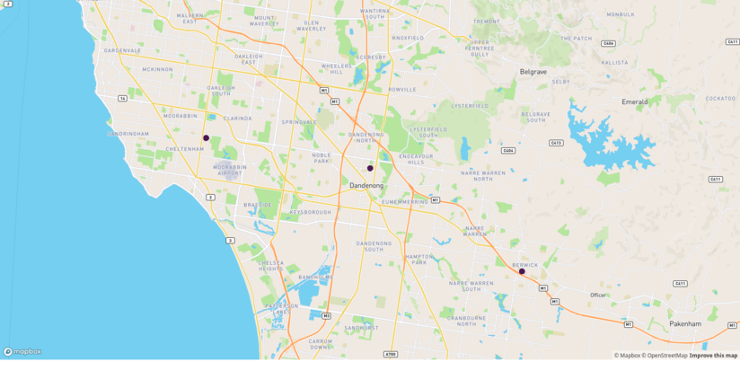
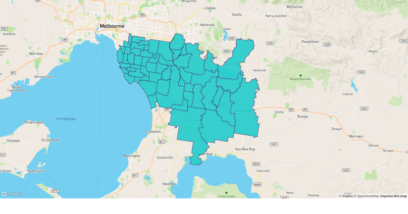
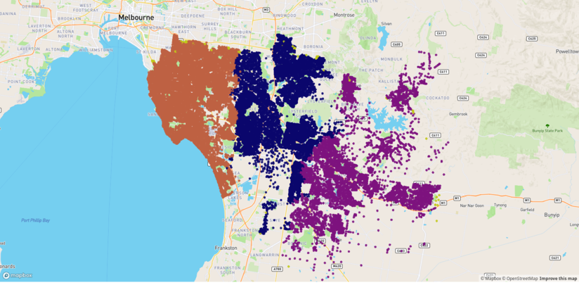
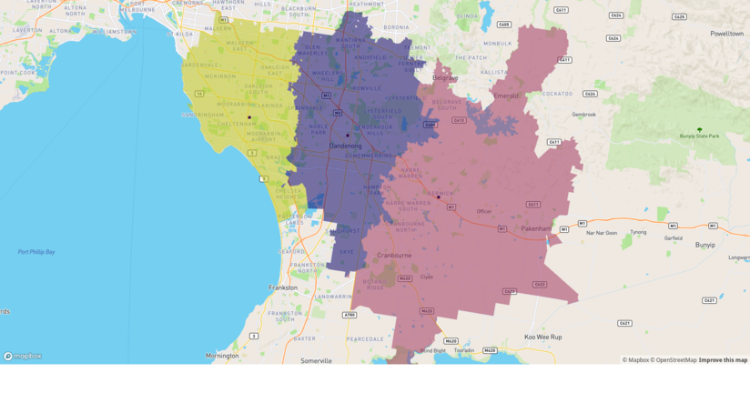

## 0\. Package installation

``` r
library(tidyverse)
library(sf)
library(units)
library(tmaptools)
#> Warning in fun(libname, pkgname): rgeos: versions of GEOS runtime 3.7.1-CAPI-1.11.1
#> and GEOS at installation 3.7.0-CAPI-1.11.0differ
if (requireNamespace ("mapview"))
    library (mapview)
```

## 1\. Loading census and boundary data

Load postcode boundaries and demographic data from the 2016 census.

``` r
postcodeboundariesAUS <- 
    file.path(here::here(), "ABSData", "Boundaries/POA_2016_AUST.shp") %>%
    sf::read_sf ()

basicDemographicsVIC <- file.path(here::here(), "ABSData",
                                  "2016 Census GCP Postal Areas for VIC",
                                  "2016Census_G01_VIC_POA.csv") %>%
    readr::read_csv()
#> Parsed with column specification:
#> cols(
#>   .default = col_double(),
#>   POA_CODE_2016 = col_character()
#> )
#> See spec(...) for full column specifications.
```

Clean up the demographics to only those columns that we’re interested
in. Presume just for illustrative purposes here that those are only the
basic “Age” classes. There are also columns about the ages of persons
attending educational institutions which need to be removed.

``` r
basicDemographicsVIC <- select(basicDemographicsVIC, POA_CODE_2016,
                               starts_with("Age_"),
                               -starts_with("Age_psns_"))
```

## 2\. Geocoding hospital locations

``` r
rehab_addresses <- c(DandenongHospital = "Dandenong Hospital, Dandenong VIC 3175, Australia",
                     CaseyHospital = "62-70 Kangan Dr, Berwick VIC 3806, Australia",
                     KingstonHospital = "The Kingston Centre, Heatherton VIC 3202, Australia")
RehabLocations <- tmaptools::geocode_OSM(rehab_addresses, as.sf=TRUE)
```

These `RehabLocations` then need to be transformed to the same
coordinate reference system as the `basicDemographicsVIC`.

``` r
RehabLocations <- sf::st_transform(RehabLocations,
                                   sf::st_crs(postcodeboundariesAUS))
```

These locations can then be viewed with `mapview` in one line:

``` r
mapview (RehabLocations)
```



## 3\. Combine demographics and spatial data

Join the demographics and shape tables of postcode boundaries, retaining
Victoria only. Use postcode boundaries as the reference data frame so
that coordinate reference system is retained.

``` r
basicDemographicsVIC <- right_join(postcodeboundariesAUS,
                                   basicDemographicsVIC, 
                                   by=c("POA_CODE" = "POA_CODE_2016"))
```

## 4\. Compute distance to each service centre from each postcode

There are 698 postcodes which we now want to reduce to only those within
a specified distance of the rehab locations, chosen here as 10km. Note
that we just use straight line distances here, because we only need to
roughly determine which postcodes surround our rehab centres, and that
distances are calculated to centroids of each postcode polygon. The
subsequent calculations will then use more accurate distances along
street networks. (Running this code produces a warning that
`st_centroid` does not give correct results for longitude/latitude data,
but results are nevertheless good enough for our purposes here.)

``` r
dist_to_loc <- function (geometry, location){
    units::set_units(st_distance(st_centroid (geometry), location)[,1], km)
}
dist_range <- units::set_units(10, km)

basicDemographicsVIC <- mutate(basicDemographicsVIC,
       DirectDistanceToDandenong = dist_to_loc(geometry,RehabLocations["DandenongHospital", ]),
       DirectDistanceToCasey     = dist_to_loc(geometry,RehabLocations["CaseyHospital", ]),
       DirectDistanceToKingston  = dist_to_loc(geometry,RehabLocations["KingstonHospital", ]),
       DirectDistanceToNearest   = pmin(DirectDistanceToDandenong,
                                        DirectDistanceToCasey,
                                        DirectDistanceToKingston)
    )
#> Warning in st_centroid.sfc(geometry): st_centroid does not give correct
#> centroids for longitude/latitude data

#> Warning in st_centroid.sfc(geometry): st_centroid does not give correct
#> centroids for longitude/latitude data

#> Warning in st_centroid.sfc(geometry): st_centroid does not give correct
#> centroids for longitude/latitude data

basicDemographicsRehab <- filter(basicDemographicsVIC,
                                 DirectDistanceToNearest < dist_range) %>%
        mutate(Postcode = as.numeric(POA_CODE16)) %>%
        select(-starts_with("POA_"))
```

That reduces the data down to 45 nearby postcodes, with the last 2 lines
converting all prior postcode columns (of which there were several all
beginning with “POA”) to a single numeric column named “Postcode”.

``` r
mapview (basicDemographicsRehab)
```


## 5\. Sample postcodes

Select random addresses using a geocoded database, available via the
`PSMA` package.

``` r
if (!"PSMA" %in% installed.packages() [, 1])
    devtools::install_github("HughParsonage/PSMA")
```

We then specify how many random addresses we want to sample per
postcode. These addresses will provide the points ultimately used to
determine case loads for the three rehab centres.

``` r
addressesPerPostcode <- 1000
```

We then write a special function so we can sample the postcodes as we
go. Sampling syntax is due to the use of data.table inside PSMA. The
last `st_as_sf()` command converts the points labelled “LONGITUDE” and
“LATITUDE” into `sf::POINT` objects. (This function takes a few
seconds because of the `fetch_postcodes` call.)

``` r
library(PSMA)
samplePCode <- function(pcode, number) {
  d <- fetch_postcodes(pcode)
  return(d[, .SD[sample(.N, min(number, .N))], by=.(POSTCODE)])
}

randomaddresses <- map(basicDemographicsRehab$Postcode,
                       samplePCode,
                       number=addressesPerPostcode) %>%
            bind_rows() %>%
            sf::st_as_sf(coords = c("LONGITUDE", "LATITUDE"),
                         crs=st_crs(basicDemographicsRehab),
                         agr = "constant")
head(randomaddresses)
#> Simple feature collection with 6 features and 13 fields
#> Attribute-geometry relationship: 13 constant, 0 aggregate, 0 identity
#> geometry type:  POINT
#> dimension:      XY
#> bbox:           xmin: 145.0417 ymin: -37.8912 xmax: 145.0883 ymax: -37.87502
#> epsg (SRID):    4283
#> proj4string:    +proj=longlat +ellps=GRS80 +towgs84=0,0,0,0,0,0,0 +no_defs
#>   POSTCODE ADDRESS_DETAIL_INTRNL_ID STREET_LOCALITY_INTRNL_ID
#> 1     3145                 11867097                    590471
#> 2     3145                 11125442                    595798
#> 3     3145                 12448830                    590471
#> 4     3145                 10468049                    545224
#> 5     3145                  9595694                    473577
#> 6     3145                 12708095                    493845
#>               BUILDING_NAME LOT_NUMBER FLAT_NUMBER NUMBER_FIRST
#> 1                      <NA>       <NA>         472         1341
#> 2                      <NA>       <NA>          NA           48
#> 3 PC USERS GROUP-C'STONE SC       <NA>         250         1341
#> 4                      <NA>       <NA>           6            2
#> 5                      <NA>       <NA>          22          800
#> 6                      <NA>       <NA>         308            2
#>   STREET_NAME STREET_TYPE_CODE lat_int  lat_rem lon_int lon_rem
#> 1   DANDENONG             ROAD     -37 -8876953     145  805995
#> 2       BOWEN           STREET     -37 -8834820     145  778160
#> 3   DANDENONG             ROAD     -37 -8876953     145  805995
#> 4   TATTENHAM           STREET     -37 -8830779     145  477860
#> 5    WARRIGAL             ROAD     -37 -8911958     145  882934
#> 6    CLARENCE           STREET     -37 -8750235     145  416781
#>                     geometry
#> 1  POINT (145.0806 -37.8877)
#> 2 POINT (145.0778 -37.88348)
#> 3  POINT (145.0806 -37.8877)
#> 4 POINT (145.0478 -37.88308)
#> 5  POINT (145.0883 -37.8912)
#> 6 POINT (145.0417 -37.87502)
```

## 6\. Display sample addresses and postcodes

Note that there are 44000 random addresses. Plotting this many points
can be quite slow using `mapview`, so if you want to view the results,
you might need to be patient. (Much faster plotting can be achieved with
an API key via `mapdeck`.)

``` r
mapview(randomaddresses, cex = 2, color = "blue")
```


These postcode polygons can be viewed with `mapview` like this:

``` r
mapview (basicDemographicsRehab)
```



## 7\. Create a street network database

Computing the road distance and travel time from each address to each
hospital first requires a local copy of the street network within the
bounding polygon defined by `basicDemographicsRehab`. This is easiest
done with the `dodgr` package, which directly calls the `osmdata`
package to do the downloading.

The basic way to download the street network is within a defined,
implicitly rectangular, bounding box, but in this case that extends from
Mornington to St Kilda, and out to the Dandenongs, and even Koo Wee
Rup\! It is much better to extract the street network only within the
polygon defining our nearby postcode areas, which first needs to be
re-projected onto the CRS of OpenStreetMap data, which is epsg4326.
`st_union` merges all of the polygons to form the single enclosing
polygon, and the final command simply extracts the longitudinal and
latitudinal coordinates of that polygon (rather than leaving them in
`sf` format).

``` r
bounding_polygon <- sf::st_transform(basicDemographicsRehab,
                                     sf::st_crs(4326)) %>%
    sf::st_union () %>%
    sf::st_coordinates ()
bounding_polygon <- bounding_polygon [, 1:2]
```

We can now download the street network enclosed within that polygon.
Note that this is still a rather large network - over 40MB of data
representing over 60,000 street sections - that might take a minute or
two to process. It is therefore easier to save the result to disc for
quicker re-usage.

``` r
library(dodgr)
system.time (
dandenong_streets <- dodgr_streetnet (bounding_polygon, expand = 0, quiet = FALSE)
)
saveRDS (dandenong_streets, file = "dandenong-streets.Rds")
```

This generates a file that is 41 MB in size. The network can then be
re-loaded with

``` r
dandenong_streets <- readRDS ("dandenong-streets.Rds")
```

revealing that the number of distinct street lines in this street
network is

``` r
format (nrow (dandenong_streets), big.mark = ",")
#> [1] "62,624"
```

## 8\. Estimation of travel time

Travel time is estimated here from distance along the stret network. The
`dodgr` package needs to de-compose the `sf`-formatted street network,
which consists of long, connected road segments, into individual edges.
This is done with the `weight_streetnet()` function, which modifies the
distance of each edge to reflect typical travel conditions for a
nominated mode of transport.

``` r
library (dodgr)
net <- weight_streetnet (dandenong_streets, wt_profile = "motorcar")
format (nrow (net), big.mark = ",")
#> [1] "626,391"
```

This command has decomposed the 62,624 streets into 626,391 disinct
segments. The resultant network has a `d_weighted` column which
preferentially weights the distances for the nominated mode of tranport.
Those parts of the network which are unsuitable for vehicular transport
have values of `.Machine$double.xmax =` `r .Machine$double.xmax`.
Because we want to align our random points to the *routable* component
of the network, these need to be removed.

``` r
net <- net [which (net$d_weighted < .Machine$double.xmax), ]
nrow (net)
#> [1] 437145
```

This reduces the number of edges in the network to 437,145. We can now
use the `net` object to calculate the distances, along with simple
numeric coordinates of our routing points, projected on to the same CRS
as OpenStreetMap (OSM), which is
4326:

``` r
fromCoords <- st_coordinates (st_transform (randomaddresses, crs = 4326))
toCoords <- st_coordinates (st_transform (RehabLocations, crs = 4326))
```

Although not necessary, distance calculation is quicker if we map these
`from` and `to` points precisely on to the network itself. OSM assigns
unique identifiers to every single object, and so our routing
coordinates can be converted to OSM identifiers of the nearest street
nodes. The nodes themselves are obtained with the `dodgr_vertices()`
function.

``` r
nodes <- dodgr_vertices (net)
fromIDX <- match_pts_to_graph (nodes, fromCoords, connected = TRUE)
from <- unique (nodes$id [fromIDX])
to <- nodes$id [match_pts_to_graph (nodes, toCoords, connected = TRUE)]
```

The matrices of `from` and `to` coordinates have now been converted to
simple vectors of OSM identifiers. Calculating the pair-wise distances
between all of those coordinates is as simple as,

``` r
d <- dodgr_dists (net, from = from, to = to)
```

And that takes only around 0.9 seconds to calculate distances between (3
rehab centres times 20,000 random addresses = ) 60,000 pairs of points.
Travel times may then be presumed directly proportional to those
distances.

## 9\. Address-based catchment basins

First assign each point to its nearest hospital according to the street
network distances returned from `dodgr_dists`. Note that points on the
outer periphery of the network may not necessarily be connected to the
main part of the network, as we’ll see below. The following code assigns
each source address to the nearest destination.

``` r
DestNames <- c(rownames(RehabLocations), "Disconnected")
DestNumber <- as.numeric (apply(d, MARGIN=1, which.min))
DestNumber [is.na (DestNumber)] <- 4 # the disconnected points
BestDestination <- DestNames[DestNumber]
table (BestDestination)
#> BestDestination
#>     CaseyHospital DandenongHospital      Disconnected  KingstonHospital 
#>              3965              9322                20             11752
```

And there are 20 points that are not connected. The allocation of
points, including these disconnected ones, can be inspected on a map
with the following code, start by setting up a `data.frame` of
`fromCoords`.

``` r
fromCoords <- nodes [match (from, nodes$id), ]
fromCoords$DestNumber <- DestNumber
fromCoords$Destination <- BestDestination
```

The results can be viewed with `mapview`, first requiring these points
to be converted to `sf` form, where `coords = 2:3` simply specifies the
longitude and latitude columns, and the `select` command filters the
data down to just the geometrical points and the `DestNumber`, so the
latter will be automatically used to colour the `mapview` points.

``` r
fromCoords_sf <- st_as_sf (fromCoords, coords = 2:3, crs = 4326) %>%
    select (c (DestNumber, geometry))
mapview (fromCoords_sf)
```



This map (in its interactive form) clearly reveals that the 20
destinations that are disconnected from the street network all lie in
the periphery, and can be simply discarded.

## 10\. Polygon catchment basins

As a final step, we’ll convert those clusters of points into enclosing
polygons, using a Voronoi tesselation. `sf::st_voronoi` doesn’t return
the polygons in the same order as the original points, requiring a
manual re-sorting in order to use this to match voronoi polygons to
points for each catchment.

``` r
g <- st_multipoint(as.matrix(fromCoords[,c("x", "y")]))
v <- st_voronoi(x=g) # results in geometry collection objects
v <- st_collection_extract(v) # converts to polygons
fromCoords_sf <- st_as_sf(fromCoords, coords=c("x", "y"))
vorder <- unlist(st_intersects(fromCoords_sf, v))
v <- v[vorder] # polygons in same order as points
v <- st_sf (DestNumber = fromCoords$DestNumber,
            Destination = fromCoords$Destination,
            geometry = v,
            crs = 4326)
```

We then just need to filter those Voronoi polygons associated with each
catchment, and extract the surrounding polygons. (This can take quite
some time.)

``` r
bounding_polygon <- sf::st_transform(basicDemographicsRehab,
                                     sf::st_crs(4326)) %>%
  sf::st_union () 
v <- lapply (1:3, function (i) {
                 v [v$DestNumber == i, ] %>%
                     st_intersection (bounding_polygon) %>%
                     st_union() })
v <- st_sf (DestNumber = 1:3,
            Destination = DestNames [1:3],
            geometry = do.call (c, v))
```

Then plot with `mapview`, with easy addition of rehab centres:

``` r
mapview (v) %>%
    addFeatures (data = RehabLocations)
```



## 11\. Estimate caseload per centre

Finally, we need a per postcode breakdown of proportion of addresses
going to each centre, so that we can compute the number of cases going
to each centre. The above procedure occasionally mapped multiple
addresses onto the same network points. As we were only interested in
the enclosing polygons, these repeated points were removed. In the
present case, however, these repeats need to be counted, so we need to
go back to where we were before, which is the `randomaddresses`.

``` r
dim (randomaddresses); dim (fromCoords)
#> [1] 44000    14
#> [1] 25059     7
length (from); length (DestNumber)
#> [1] 25059
#> [1] 25059
```

We need to repeat the calculation of `DestNumber` using the full set of
`fromCoords`, including those repeatedly matched onto same network
points.

``` r
fromCoords <- st_coordinates (st_transform (randomaddresses, crs = 4326))
fromIDX <- match_pts_to_graph (nodes, fromCoords, connected = TRUE)
from <- nodes$id [fromIDX]
to <- nodes$id [match_pts_to_graph (nodes, toCoords, connected = TRUE)]
d <- dodgr_dists (net, from = from, to = to)
DestNames <- c(rownames(RehabLocations), "Disconnected")
DestNumber <- as.numeric (apply(d, MARGIN=1, which.min))
DestNumber [is.na (DestNumber)] <- 4 # the disconnected points
BestDestination <- DestNames[DestNumber]
```

The following lines then group the above data by both postcode and
destination hospital.

``` r
postcodes <- data.frame (POSTCODE = randomaddresses$POSTCODE,
                         DestNumber = DestNumber,
                         Destination = BestDestination,
                         stringsAsFactors = FALSE) %>%
    group_by (POSTCODE, DestNumber, Destination) %>%
    summarise (n = length (DestNumber))
postcodes
```

| POSTCODE | DestNumber | Destination       |    n |
| -------: | ---------: | :---------------- | ---: |
|     3145 |          3 | KingstonHospital  | 1000 |
|     3147 |          3 | KingstonHospital  |  998 |
|     3147 |          4 | Disconnected      |    2 |
|     3148 |          3 | KingstonHospital  | 1000 |
|     3149 |          1 | DandenongHospital |   78 |
|     3149 |          3 | KingstonHospital  |  918 |

This table provides the breakdown for each postcode of cases going to
each rehab centre. We simply need to allocate all of these to each
centre with the following code, which converts the final estimated total
cases to each centre into relative proportions.

``` r
postcodes %>%
    filter (Destination != "Disconnected") %>%
    group_by (Destination) %>%
    summarise (total = sum (n)) %>%
    mutate (percent = 100 * total / sum (total))
```

| Destination       | total | percent |
| :---------------- | ----: | ------: |
| CaseyHospital     |  6086 |   13.84 |
| DandenongHospital | 14188 |   32.26 |
| KingstonHospital  | 23700 |   53.90 |

Those results reflect random samples from each postcode, and so do not
reflect possible demograhic differences in stroke rates between
postcodes. That can be derived using the following table of stroke
incidence per 100,000:

| Age   | Incidence |
| ----- | --------- |
| 0-14  | 0         |
| 15-24 | 5         |
| 25-34 | 30        |
| 35-44 | 44        |
| 45-54 | 111       |
| 55-64 | 299       |
| 65-74 | 747       |
| 75-84 | 1928      |
| 85+   | 3976      |

We have the demographic profile of each postcode in
`basicDemographicsRehab`, for which we now need to regroup some of the
columns (0-4 + 5-14, and 15-19 + 20-24). This then gives the total
population for that postcode for each demographic group, from which we
can work out the expected stroke incidence. The following code also
removes previous demographic columns (the `select` line).

``` r
basicDemographicsRehab <- filter(basicDemographicsVIC,
                                 DirectDistanceToNearest < dist_range) %>%
        mutate(Postcode = as.numeric(POA_CODE16)) %>%
        select(-starts_with("POA_"))
```

``` r
s <- 1 / 100000 # rate per 100,000
basicDemographicsRehab <- basicDemographicsRehab %>%
    mutate (stroke_rate = s * ((Age_15_19_yr_P + Age_20_24_yr_P) * 5 +
            Age_25_34_yr_P * 30 +
            Age_35_44_yr_P * 44 +
            Age_45_54_yr_P * 111 +
            Age_55_64_yr_P * 299 +
            Age_65_74_yr_P * 747 +
            Age_75_84_yr_P * 1928 +
            Age_85ov_P * 3976)) %>%
    select (-c (contains ("_yr_"), contains ("85ov")))
```

This then just needs to be mapped back on to our `postcodes` data of
number allocated to each rehab centre from each
postcode.

``` r
basicDemographicsRehab <- rename (basicDemographicsRehab, POSTCODE = Postcode)
postcodes <- left_join (postcodes, basicDemographicsRehab, by = "POSTCODE") %>%
    select (POSTCODE, DestNumber, Destination, stroke_rate)
postcodes
#> # A tibble: 61 x 4
#> # Groups:   POSTCODE, DestNumber [61]
#>    POSTCODE DestNumber Destination       stroke_rate
#>       <dbl>      <dbl> <chr>                   <dbl>
#>  1     3145          3 KingstonHospital         66.2
#>  2     3147          3 KingstonHospital         48.2
#>  3     3147          4 Disconnected             48.2
#>  4     3148          3 KingstonHospital         22.0
#>  5     3149          1 DandenongHospital       131. 
#>  6     3149          3 KingstonHospital        131. 
#>  7     3149          4 Disconnected            131. 
#>  8     3156          1 DandenongHospital       103. 
#>  9     3156          2 CaseyHospital           103. 
#> 10     3156          4 Disconnected            103. 
#> # … with 51 more rows
```

We then just need to repeat the previous code, multiplying the estimated
`total` by our new `stroke_rate` variable.

``` r
postcodes %>%
    filter (Destination != "Disconnected") %>%
    group_by (Destination) %>%
    summarise (total = sum (stroke_rate)) %>%
    mutate (percent = 100 * total / sum (total))
```

| Destination       | total | percent |
| :---------------- | ----: | ------: |
| CaseyHospital     |   477 |   12.98 |
| DandenongHospital |  1350 |   36.75 |
| KingstonHospital  |  1846 |   50.26 |
