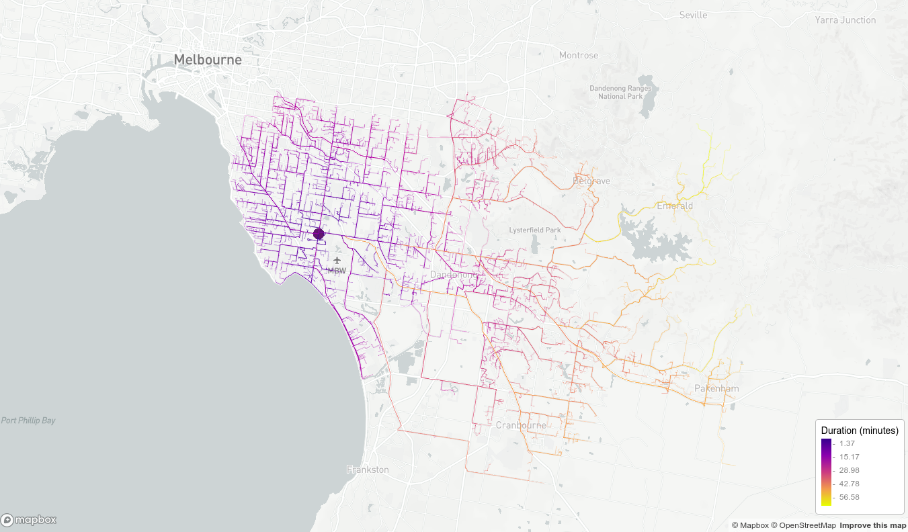
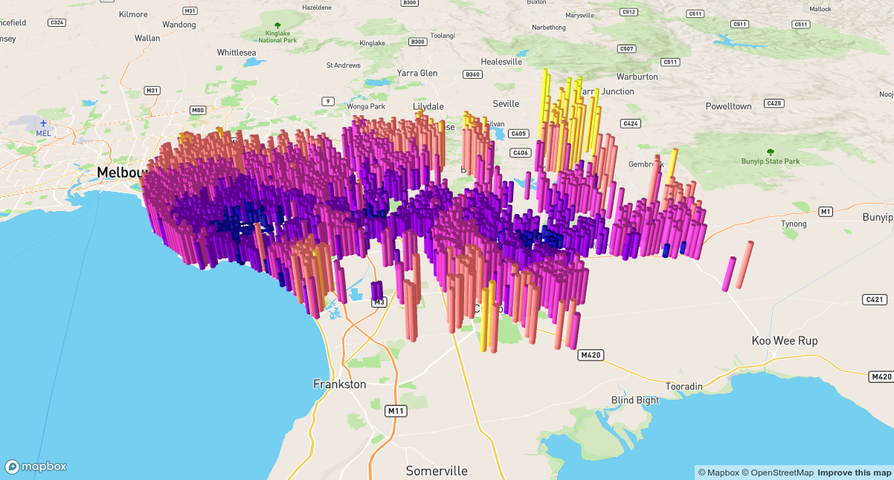

## Introduction

This document reproduces the rehabilitation center catchment basin example using services that require API keys. It is therefore
a more advanced example that requires some setup by the user, specifically creating and installing access tokens and API keys, as discussed
below.

The document has been created using the author's keys and access tokens to produce 
screenshots and fetch some data and all code is included. However no keys are 
distributed with the document. Users will therefore need to obtain their own keys in order to experiment with
the interactive options provided by `mapdeck` and the various Google services. 

```{r setup, include=FALSE}
knitr::opts_chunk$set(echo = TRUE)

library(mapdeck)
library(googleway)
library(here)
library(dplyr)
```


The `googleway` library provides access to Google Maps API, both for creating maps, and using the mapping services such as geocoding, direction and route finding, and searching for places. 

The `mapdeck` library allows you to plot large amounts of data on a Mapbox map through the `Deck.gl` javascript library developed by Uber. 

To use any of Google Map's services you will need an [API key](https://developers.google.com/maps/documentation/javascript/get-api-key), and to plot a Mapbox map you will need an [access token](https://docs.mapbox.com/help/how-mapbox-works/access-tokens/)

```{r visualisationGoogleway, echo = FALSE, eval = FALSE, include = FALSE} 

set_key(read.dcf("~/Documents/.googleAPI", fields = "GOOGLE_MAP_KEY"), api = "map")
set_key(read.dcf("~/Documents/.googleAPI", fields = "GOOGLE_API_KEY"))
set_token( read.dcf("~/Documents/.googleAPI", fields = "MAPBOX" ) )
```

Replace "GOOGLE_MAP_KEY", "GOOGLE_API_KEY", "MAPBOX_TOKEN" with the respective tokens. The tokens are long collections of random characters and numbers and the should be
surrounded by quotes.
```{r eval = FALSE}

set_key( "GOOGLE_MAP_KEY", api = "map") ## for Google Maps
set_key( "GOOGLE_API_KEY")  ## for other Google services
set_token( "MAPBOX_TOKEN" )

```

In this section we are calculating the times and distances to the rehab centres from random addresses using Google's API (using the `googleway` library), and plotting the maps using the `mapdeck` library. 

The random address list, demographic data, and calculations used to determine case load per rehab centre are taken from section 11 of the Rehab Catchment Basement section.

## Geocoding

The geocoding API will take as input an address, or search term, and return various pieces of information. For example, here we are querying the API for the three rehab centre addresses.

```{r, eval = FALSE}
rehab_addresses <- c(
  DandenongHospital = "Dandenong Hospital, Dandenong VIC 3175, Australia",
  CaseyHospital = "62-70 Kangan Dr, Berwick VIC 3806, Australia",
  KingstonHospital = "The Kingston Centre, Heatherton VIC 3202, Australia"
  )

RehabLocations <- lapply(rehab_addresses, googleway::google_geocode)
```

```{r eval = FALSE, echo = FALSE}
saveRDS(RehabLocations, file = "../data/googleway/RehabLocations_googleway.rds")
```

```{r, eval = TRUE, echo = FALSE}
RehabLocations <- readRDS("../data/googleway/RehabLocations_googleway.rds")
```

From the results we can extract various pieces of information, such as the formatted address, the type of place, and the coordinates.

```{r}
lapply( RehabLocations, googleway::geocode_address )
lapply( RehabLocations, googleway::geocode_address_components )
lapply( RehabLocations, googleway::geocode_coordinates )

```


## Estimate of travel time


We have 56,000 random addresses, and 3 rehab centres. This makes `r format( 56000 * 3, big.mark = ",")` direction queries. 

Google charges 0.005 USD per query, but gives you $200 credit each month.

Therefore, we get `r format(200 / 0.005, big.mark= ",")` queries credited per month. 

To stay within limits, and have enough spare, I'm going to sample 50 of those random addresses per postcode, and query the API for the directions from those addresses to each rehab centres. 


The first step is to format the results of the geocoding into an easily usable structure

```{r}

## formatting the geocoded rehab centres into a data.frame
lst <- lapply( RehabLocations, function(x) {
  coords <- googleway::geocode_coordinates(x)
  data.frame(
    formatted_address = googleway::geocode_address( x ),
    lat = coords[["lat"]],
    lon = coords[["lng"]]
    )
})

df_rehab <- do.call(rbind, lst)
rm(lst)

knitr::kable( df_rehab )

```


To find the directions we need to query one route at a time. We can do this in an `lapply`. 

As this takes a while we are saving the results of each query to file at each iteration. Each result is in JSON, so we are saving the raw JSON.

```{r, echo = FALSE }

randomaddresses <- readRDS(here::here("data/googleway/randomaddresses/randomaddresses.rds"))

```


```{r, eval = FALSE, echo = TRUE, include = TRUE}

# ## TODO - get randomaddresses from RehabCatchment
# ## need coordinates for googleway
df_random <- as.data.frame( randomaddresses )
df_random[, c("lon", "lat")] <- sf::st_coordinates( randomaddresses )

set.seed(12345)
df_sample <- df_random %>%
  dplyr::group_by(POSTCODE) %>%
  dplyr::sample_n(size = 50)

df_sample$sample_row <- 1:nrow(df_sample)

saveRDS(df_sample, here::here("data/googleway/directions_queries/df_sample2.rds"))

res1 <- lapply(1:nrow(df_sample), function(x) {
  
  js <- googleway::google_directions(
    origin = as.numeric( df_sample[x, c("lat", "lon")] )
    , destination = as.numeric( df_rehab[1, c("lat","lon")] )
    , simplify = F
  )
  js <- paste0(js, collapse = "")
  js <- gsub(" ","",js)
  fn <- here::here(paste0("data/googleway/directions_queries/rehab1_sample/",x,"_results.json"))
  f <- file(fn)
  writeLines(js, f)
  close(f)
  return( js )
})

res2 <- lapply(1:nrow(df_sample), function(x) {
  js <- googleway::google_directions(
    origin = as.numeric( df_sample[x, c("lat", "lon")] )
    , destination = as.numeric( df_rehab[2, c("lat","lon")] )
    , simplify = F
  )
  js <- paste0(js, collapse = "")
  js <- gsub(" ","",js)
  fn <- here::here(paste0("data/googleway/directions_queries/rehab2_sample/",x,"_results.json")
  f <- file(fn)
  writeLines(js, f)
  close(f)
  return( js )
})

res3 <- lapply(1:nrow(df_sample), function(x) {
  js <- googleway::google_directions(
    origin = as.numeric( df_sample[x, c("lat", "lon")] )
    , destination = as.numeric( df_rehab[3, c("lat","lon")] )
    , simplify = F
  )
    js <- paste0(js, collapse = "")
  js <- gsub(" ","",js)
  fn <- here::here(paste0("data/googleway/directions_queries/rehab3_sample/",x,"_results.json"))
  f <- file(fn)
  writeLines(js, f)
  close(f)
  return( js )
})

```

```{r, echo = FALSE}
df_sample <- readRDS(here::here("data/googleway/directions_queries/df_sample2.rds"))
```


Now we have all the results of the directions query saved we can read them back into the R session.

```{r, echo = TRUE, include = FALSE, eval = FALSE}

get_directions <- function(rehab) {
  path <- here::here("data/googleway/directions_queries")
  lst_files <- list.files(path = paste0(path, rehab) )
  files <- paste0(path, rehab, lst_files)

  lst <- lapply( files, function(x) {
    js <- jsonlite::fromJSON( x )
    bname <- basename( x )
    sample_row <- gsub("[^0-9]","",bname)
    list(sample_row = sample_row, result = js)
  })
  
  return( lst )
}

directions1 <- get_directions( "/rehab1_sample/")
directions2 <- get_directions( "/rehab2_sample/")
directions3 <- get_directions( "/rehab3_sample/")
```

```{r echo = FALSE, include = FALSE, eval = FALSE}

saveRDS(directions1, file = here::here("data/googleway/directions/directions1_sample.rds"))
saveRDS(directions2, file = here::here("data/googleway/directions/directions2_sample.rds"))
saveRDS(directions3, file = here::here("data/googleway/directions/directions3_sample.rds"))

```

```{r, echo = FALSE}
directions1 <- readRDS(here::here("data/googleway/directions/directions1_sample.rds"))
directions2 <- readRDS(here::here("data/googleway/directions/directions2_sample.rds"))
directions3 <- readRDS(here::here("data/googleway/directions/directions3_sample.rds"))
```


The route geometry returned from the API comes in the form of an [encoded polyline](https://developers.google.com/maps/documentation/utilities/polylinealgorithm).  

```{r}
substr( googleway::direction_polyline( directions1[[1]][["result"]] ), 1, 100 )
```

We can convert this back into coordinates using the `googlePolylines` library, for example

```{r}
pl <- googleway::direction_polyline( directions1[[1]][["result"]] )

head( googlePolylines::decode( pl )[[1]] )
```

However, `googleway` and `mapdeck` both support plotting these polylines directly, so we can avoid this step and just use the polylines. We also get the distance and time on the routes in the API query results. 

```{r}

is_valid <- function( direction ) {
  direction[["result"]][["status"]] == "OK"
}

get_distance <- function(x) {
  ifelse(
    is_valid( x )
    , googleway::direction_legs(x[["result"]])[["distance"]][["value"]]
    , NA_real_
    )
}
get_duration <- function(x) {
  ifelse(
    is_valid( x )
    , googleway::direction_legs(x[["result"]])[["duration"]][["value"]]
    , NA_real_
    )
}

get_polyline <- function(x) {
  ifelse(
    is_valid( x )
    , googleway::direction_polyline( x[["result"]] )
    , NA_character_
  )
}

format_directions <- function( d, df_sample ) {
  secs <- sapply( d, get_duration )
  dist <- sapply( d, get_distance )
  sample_row <- sapply( d, function(x) x[["sample_row"]] )
  street <- df_sample[ sample_row, ]$STREET_NAME
  postcode <- df_sample[ sample_row, ]$POSTCODE
  polylines <- sapply( d, get_polyline )
  data.frame(
    id = sample_row
    , street = street
    , POSTCODE = postcode    ## capitalised because we join on it later
    , polyline = polylines
    , distance_m = dist
    , duration_s = secs
    , duration_m = round( secs / 60, 2 )
    , stringsAsFactors = FALSE
  )
}

df_directions1 <- format_directions( directions1, df_sample )
df_directions2 <- format_directions( directions2, df_sample )
df_directions3 <- format_directions( directions3, df_sample )

```

The `is_valid()` function is used to test the result of the API query. Sometimes the API will return an "ACCESS_DENIED" or "OVER_QUERY_LIMIT" response if it wasn't able to return any data. 

Now we have three data.frames, each containing the directions, distance, times and route for 2,800 random addresses to the rehab centres. 

```{r, eval = FALSE}

mapdeck(
  style = mapdeck_style("light")
  , location = c(145, -37.9)
  , zoom = 10
) %>%
  add_scatterplot(
    data = df_rehab[1, ]
    , lon = "lon", lat = "lat"
    , radius = 500
    , update_view = F
  ) %>%
  add_path(
    data = df_directions1[ !is.na( df_directions1$polyline ), ]
    , polyline = "polyline"
    , stroke_colour = "duration_m"
    , stroke_opacity = 100
    , stroke_width = 35
    , legend = T
    , legend_options = list( title = "Duration (minutes) ")
    , update_view = F
    , palette = "plasma"
  )

```


```{r, eval = FALSE}

mapdeck(
  style = mapdeck_style("light")
  , location = c(145, -37.9)
  , zoom = 10
) %>%
  add_scatterplot(
    data = df_rehab[2, ]
    , lon = "lon", lat = "lat"
    , radius = 500
    , update_view = F
  ) %>%
  add_path(
    data = df_directions2[ !is.na( df_directions2$polyline ), ]
    , polyline = "polyline"
    , stroke_colour = "duration_m"
    , stroke_opacity = 100
    , stroke_width = 35
    , legend = T
    , legend_options = list( title = "Duration (minutes) ")
    , update_view = F
    , palette = "plasma"
  )

```


```{r, eval = FALSE}

mapdeck(
  style = mapdeck_style("light")
  , location = c(145, -37.9)
  , zoom = 10
) %>%
  add_scatterplot(
    data = df_rehab[3, ]
    , lon = "lon", lat = "lat"
    , radius = 500
    , update_view = F
  ) %>%
  add_path(
    data = df_directions3[ !is.na( df_directions3$polyline ), ]
    , polyline = "polyline"
    , stroke_colour = "duration_m"
    , stroke_opacity = 100
    , stroke_width = 35
    , legend = T
    , legend_options = list( title = "Duration (minutes) ")
    , update_view = F
    , palette = "plasma"
  )

```




```{r, eval = FALSE}

mapdeck(
  style = mapdeck_style("light")
  , location = c(145, -37.9)
  , zoom = 10
) %>%
  add_scatterplot(
    data = df_rehab
    , lon = "lon", lat = "lat"
    , radius = 500
    , update_view = F
  ) %>%
  add_path(
    data = df_directions1[ !is.na( df_directions1$polyline ), ]
    , polyline = "polyline"
    , stroke_colour = "duration_m"
    , stroke_opacity = 100
    , stroke_width = 35
    , legend = T
    , legend_options = list( title = "Duration to Dandenong (mins) ")
    , update_view = F
    , palette = "plasma"
    , layer_id = "rehab1"
  ) %>%
  add_path(
    data = df_directions2[ !is.na( df_directions2$polyline ), ]
    , polyline = "polyline"
    , stroke_colour = "duration_m"
    , stroke_opacity = 100
    , stroke_width = 35
    , legend = T
    , legend_options = list( title = "Duration to Casey (mins) ")
    , update_view = F
    , palette = "plasma"
    , layer_id = "rehab2"
  ) %>%
  add_path(
    data = df_directions3[ !is.na( df_directions3$polyline ), ]
    , polyline = "polyline"
    , stroke_colour = "duration_m"
    , stroke_opacity = 100
    , stroke_width = 35
    , legend = T
    , legend_options = list( title = "Duration to Kingston (mins) ")
    , update_view = F
    , palette = "plasma"
    , layer_id = "rehab3e"
  )

```


We can extract the step-by-step guide, including times and locations, to get the 'time to destination' for each step.

```{r}
ttd <- googleway::direction_steps( directions1[[1]][["result"]] )
total_time <- get_duration( directions1[[1]] )

## calculate time remaining at every step
ttd_duration <- ttd$duration
ttd_duration$total_time <- cumsum( ttd_duration$value )
ttd_duration$time_remaining <- total_time - ttd_duration$total_time

## get the coordinates for every step
ttd_duration <- cbind( ttd$start_location, ttd_duration )
ttd_duration
```

Doing this for each of the 8,400 directions gives us the time to the rehab centres for many points on the route, not just the origin. 

```{r}
time_to_destination <- function( direction ) {
  ttd <- googleway::direction_steps( direction[["result"]] )
  total_time <- get_duration( direction )

  ## calculate time remaining at every step
  ttd_duration <- ttd$duration
  ttd_duration$total_time <- cumsum( ttd_duration$value )
  ttd_duration$time_remaining <- total_time - ttd_duration$total_time
  
  ## get the coordinates for every step
  ttd_duration <- cbind( ttd$start_location, ttd_duration )
  ttd_duration$sample_row <- direction[["sample_row"]]

  if( inherits( ttd_duration, "data.frame" ) > 0 ) {
    ttd_duration$sample_row_pt <- 1:nrow( ttd_duration )
  }
  ttd_duration
}

lst_times <- lapply( directions1, time_to_destination )
df_times1 <- do.call(rbind, lst_times)
df_times1$rehab <- row.names(df_rehab[1, ])

lst_times <- lapply( directions2, time_to_destination )
df_times2 <- do.call(rbind, lst_times)
df_times2$rehab <- row.names(df_rehab[2, ])

lst_times <- lapply( directions3, time_to_destination )
df_times3 <- do.call(rbind, lst_times)
df_times3$rehab <- row.names(df_rehab[3, ])
```

This now gives us `r format( nrow( df_times1 ) * 3, big.mark=",")` random addresses to each of the three rehab centres. 

This plot shows the average times to `r googleway::geocode_address( RehabLocations[[1]] )` for `r nrow( df_times1 )` addresses. The height and colour of hexagons represent the average time to the rehab centre.

```{r, eval = FALSE}
mapdeck() %>%
  add_hexagon(
    data = df_times1
    , lon = "lng", lat = "lat"
    , elevation = "time_remaining"
    , elevation_function = "average"
    , colour = "time_remaining"
    , colour_function = "average"
    , elevation_scale = 10
    , radius = 250
    , colour_range = colourvalues::colour_values(1:6, palette = "plasma")
    , layer_id = "times1"
  ) 

```


```{r, eval = FALSE, echo = FALSE, include = FALSE}

# df_times1$rehab <- row.names( df_rehab[1, ] )
# df_times2$rehab <- row.names( df_rehab[2, ] )
# df_times3$rehab <- row.names( df_rehab[3, ] )
# 
# df_times <- rbind( df_times1, df_times2, df_times3 )
# 
# df_min_times <- df_times %>%
#   group_by(lat, lng) %>%
#   summarise( min_time = min( time_remaining ) )
# 
# mapdeck() %>%
#   add_hexagon(
#     data = df_min_times
#     , lon = "lng", lat = "lat"
#     , elevation = "min_time"
#     , elevation_function = "average"
#     , colour = "min_time"
#     , colour_function = "average"
#     , elevation_scale = 10
#     , radius = 250
#     , colour_range = colourvalues::colour_values(1:6, palette = "plasma")
#     , layer_id = "times1"
#   ) 

```


## Distances

While the Directions API gives us a lot of information, it only handles one direction at a time. If you want more (quantity and frequency), but less detailed results, you can query the distance API.

In this example we are querying the distances for the first ten random addresses.

```{r, eval = FALSE}

distance_matrix <- googleway::google_distance(
  origin = df_sample[1:10, c("lat", "lon")]
  , destination = googleway::geocode_address( RehabLocations[[1]] )
)
```

```{r eval = FALSE, echo = FALSE}
saveRDS(distance_matrix, here::here("data/googleway/distances/distance_matrix.rds"))
```

```{r echo = FALSE}
distance_matrix <- readRDS(here::here("data/googleway/distances/distance_matrix.rds"))
```

```{r}
distance_matrix
```


Both the distance and directions API allow you to specify the `departure_time`, so it's possible to query the time & distance for a given time of day. 


## Address-based catchment basins

From Google's API results we have the driving time to each of the rehab centres for the random addresses. So we can get the nearest rehab centre for each address and view them with mapdeck


```{r}

df_directions1$rehab <- row.names(df_rehab)[1]
df_directions2$rehab <- row.names(df_rehab)[2]
df_directions3$rehab <- row.names(df_rehab)[3]

df_directions1$rehab_address <- df_rehab[1, "formatted_address"]
df_directions2$rehab_address <- df_rehab[2, "formatted_address"]
df_directions3$rehab_address <- df_rehab[3, "formatted_address"]

df_directions <- rbind(
  df_directions1
  , df_directions2
  , df_directions3
)

df_nearest <- df_directions %>%
  dplyr::group_by(id) %>%
  dplyr::arrange(duration_m) %>%
  dplyr::slice(1) %>%
  dplyr::ungroup()

```

Here we see which rehab centre each address goes to

```{r, eval = FALSE}

mapdeck(
  style = mapdeck_style("light")
  , location = c(145.1, -37.9)
  , zoom = 10
) %>%
  add_scatterplot(
    data = df_rehab
    , lon = "lon", lat = "lat"
    , radius = 600
  ) %>%
  add_path(
    data = df_nearest
    , polyline = "polyline"
    , stroke_colour = "rehab"
    , legend = T
    , legend_options = list(css = "max-width: 300px")
    , update_view = F
  )

```


This map shows the travel times to the nearest rehab centre

```{r eval = FALSE}

mapdeck(
  style = mapdeck_style("light")
  , location = c(145.1, -37.9)
  , zoom = 10
) %>%
  add_scatterplot(
    data = df_rehab
    , lon = "lon", lat = "lat"
    , radius = 600
  ) %>%
  add_path(
    data = df_nearest
    , polyline = "polyline"
    , stroke_colour = "duration_m"
    , legend = T
    , legend_options = list(css = "max-width: 300px")
    , update_view = F
  )


```


We can represent the times to the nearest rehab centre as hexagons, where the height and colour represents the travel time. 

```{r, eval = FALSE}

df_times <- rbind(
  df_times1
  , df_times2
  , df_times3
)

df_nearest_times <- df_times %>%
  dplyr::group_by(sample_row, sample_row_pt) %>%
  dplyr::arrange(time_remaining) %>%
  dplyr::slice(1) %>%
  dplyr::ungroup()

head( df_nearest_times )

mapdeck() %>%
    add_hexagon(
    data = df_nearest_times
    , lon = "lng", lat = "lat"
    , elevation = "time_remaining"
    , elevation_function = "average"
    , colour = "time_remaining"
    , colour_function = "average"
    , elevation_scale = 10
    , radius = 250
    , colour_range = colourvalues::colour_values(1:6, palette = "plasma")
    , layer_id = "times1"
  ) 

```



## Estimate caseload per centre


```{r}
postcodes <- df_nearest %>%
  dplyr::group_by(POSTCODE, rehab) %>%
  dplyr::summarise( n = n() )

knitr::kable( head( postcodes ) )
```

```{r}

postcodes %>%
  dplyr::group_by(rehab) %>%
  dplyr::summarise( total = sum(n)) %>%
  dplyr::mutate( percent = 100 * total / sum( total ))  %>%
  knitr::kable( digits = 2)

```


```{r incidenceRate, echo = FALSE} 

basicDemographicsRehab <- readRDS(here::here("data/googleway/basicDemographicsRehab.rds"))

df_incidence <- data.frame(
  age = c("0-4","15-24","25-34","35-44","45-54","55-64","65-74","75-84","85+")
  , incidence = c(0,5,30,44,111,299,747,1928,3976)
)

```

```{r}

knitr::kable( df_incidence )

```

```{r}
s <- 1 / 100000 # rate per 100,000
basicDemographicsRehab <- basicDemographicsRehab %>%
    mutate (stroke_cases = s * ((Age_15_19_yr_P + Age_20_24_yr_P) * 5 +
            Age_25_34_yr_P * 30 +
            Age_35_44_yr_P * 44 +
            Age_45_54_yr_P * 111 +
            Age_55_64_yr_P * 299 +
            Age_65_74_yr_P * 747 +
            Age_75_84_yr_P * 1928 +
            Age_85ov_P * 3976)) %>%
    select (-c (contains ("_yr_"), contains ("85ov")))

```


```{r}

basicDemographicsRehab <- rename (basicDemographicsRehab, POSTCODE = Postcode)

postcodes <- left_join (postcodes, basicDemographicsRehab, by = "POSTCODE")


postcodesamples <- postcodes %>%
  dplyr::group_by( POSTCODE ) %>%
  summarise( totalsamples = sum( n ) )

postcodes <- left_join( postcodes, postcodesamples, by = "POSTCODE")


postcodes %>%
    group_by (rehab) %>%
    summarise (total = sum (stroke_cases * n/totalsamples, na.rm = TRUE )) %>%
    mutate (percent = 100 * total / sum (total)) %>%
    knitr::kable (digits = c (2, 0))

```
